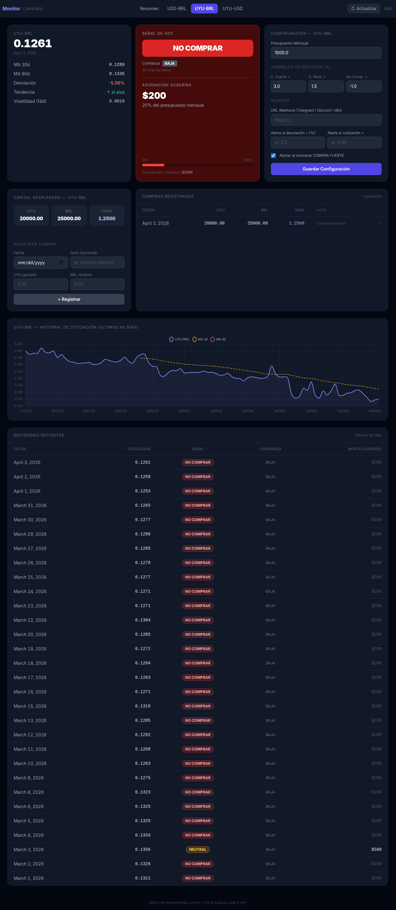

# Exchange Rate Monitor

Personal tool to find the best timing and route for converting
Uruguayan Pesos (UYU) to Brazilian Reais (BRL), monitoring three currency pairs
with technical indicators and an automatic route comparator.

**Monitored pairs:** USD-BRL · UYU-USD · UYU-BRL

---

## Quick start (local development)

```bash
uv sync
uv run manage.py migrate
uv run manage.py fetch_rates
uv run manage.py runserver
```

Open **http://localhost:8000**.

---

## Production deployment

A single Docker container runs gunicorn and django-crontab (built-in scheduler).
Caddy is installed on the host as a reverse proxy with automatic HTTPS.

```bash
git clone <repo> /opt/rates-monitor
cd /opt/rates-monitor
bash deploy/deploy.sh --setup
```

The cron scheduler updates rates **every hour** without manual intervention.
A ready-to-use Caddyfile template is provided at `deploy/Caddyfile`.

→ Full guide: [docs/deployment.md](docs/deployment.md)

---

## Documentation

| Document | Contents |
|---|---|
| [overview.md](overview.md) | Project overview, architecture, and current status |
| [docs/user-guide.md](docs/user-guide.md) | App usage, signals, configuration |
| [docs/programming-guide.md](docs/programming-guide.md) | Code structure, patterns, extension points |
| [docs/deployment.md](docs/deployment.md) | Docker Compose, VPS, SSL, cron, backups |

---

## Environment variables

Copy `.env.example` to `.env` and adjust the values:

```env
SECRET_KEY=…                   # Django secret key (required in production)
DEBUG=False
ALLOWED_HOSTS=yourdomain.com   # comma-separated; required when DEBUG=False
CSRF_TRUSTED_ORIGINS_EXTRA=…   # server domain or IP (for CSRF validation)
ACCESS_PASSCODE=…              # access passcode (empty = no protection)
DATA_DIR=                      # database directory (Docker sets this automatically)
```

When `DEBUG=False`, the following security settings are applied automatically:
`SECURE_SSL_REDIRECT`, `SECURE_HSTS_SECONDS` (1 year), `SESSION_COOKIE_SECURE`,
`CSRF_COOKIE_SECURE`, and `SECURE_CONTENT_TYPE_NOSNIFF`. No extra configuration needed.

---

## Stack

Python 3.14 · Django 6 · Gunicorn · django-crontab · Caddy · HTMX · Tailwind CSS · Chart.js · SQLite · Docker · [AwesomeAPI](https://economia.awesomeapi.com.br) (no key required)

## Screenshots

### Login (only if you define an ACCESS_PASSCODE on env)


### Dashboard


### Pair details


