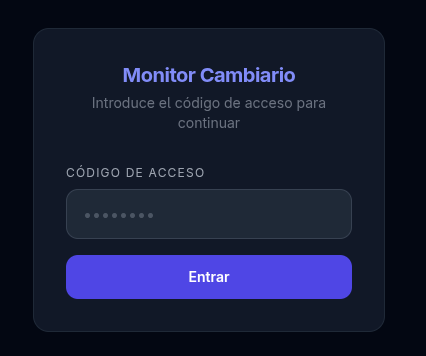
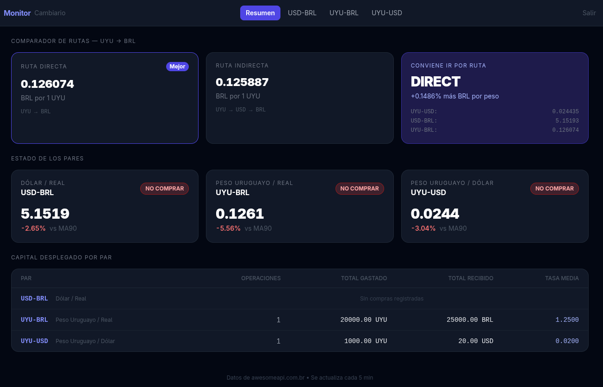
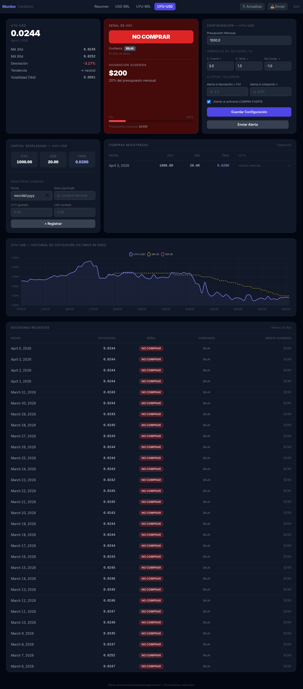

# Exchange Rate Monitor

Personal tool to find the best timing and route for converting
Uruguayan Pesos (UYU) to Brazilian Reais (BRL), monitoring three currency pairs
with technical indicators and an automatic route comparator.

**Monitored pairs:** USD-BRL · UYU-USD · UYU-BRL

---

## Quick start (local development)

```bash
uv sync
uv run manage.py migrate
uv run manage.py fetch_rates
uv run manage.py runserver
```

Open **http://localhost:8000**.

---

## Production deployment

A single Docker container runs gunicorn and django-crontab (built-in scheduler).
Caddy is installed on the host as a reverse proxy with automatic HTTPS.

```bash
git clone <repo> /opt/rates-monitor
cd /opt/rates-monitor
bash deploy/deploy.sh --setup
```

The cron scheduler refreshes all pairs and sends the Telegram snapshot
automatically at **07:00** and **12:30** server time.
A ready-to-use Caddyfile template is provided at `deploy/Caddyfile`.

→ Full guide: [docs/deployment.md](docs/deployment.md)

---

## Documentation

| Document | Contents |
|---|---|
| [overview.md](overview.md) | Project overview, architecture, and current status |
| [docs/user-guide.md](docs/user-guide.md) | App usage, signals, configuration |
| [docs/programming-guide.md](docs/programming-guide.md) | Code structure, patterns, extension points |
| [docs/deployment.md](docs/deployment.md) | Docker Compose, VPS, SSL, cron, backups |

---

## Telegram alerts

The app can send signal alerts to a Telegram chat. Set two env vars to enable:

```env
TELEGRAM_BOT_TOKEN=123456:ABC-DEF…   # from @BotFather
TELEGRAM_CHAT_ID=987654321            # your chat or group ID
```

Once configured, alerts fire automatically when a monitored condition is met
(STRONG BUY signal, deviation threshold, rate threshold). You can also send
a manual snapshot for all pairs at once using the **📤 Enviar** button in the
nav bar, or test a single pair from its configuration panel.

Each message includes rate, MA30/MA90, deviation vs MA90, momentum, confidence,
and suggested allocation — all formatted with emoji in Telegram Markdown.

→ Setup instructions: [docs/user-guide.md#alerts](docs/user-guide.md)

---

## Environment variables

Copy `.env.example` to `.env` and adjust the values:

```env
SECRET_KEY=…                   # Django secret key (required in production)
DEBUG=False
ALLOWED_HOSTS=yourdomain.com   # comma-separated; required when DEBUG=False
CSRF_TRUSTED_ORIGINS_EXTRA=…   # server domain or IP (for CSRF validation)
ACCESS_PASSCODE=…              # access passcode (empty = no protection)
TELEGRAM_BOT_TOKEN=…           # from @BotFather (optional)
TELEGRAM_CHAT_ID=…             # target chat/group ID (optional)
DATA_DIR=                      # database directory (Docker sets this automatically)

# Exchange rate source (choose one):
EXCHANGE_RATE_SOURCE=awesomeapi          # default — free, no key needed
# EXCHANGE_RATE_SOURCE=openexchangerates # alternative — requires app ID below
# OPENEXCHANGERATES_APP_ID=…            # from openexchangerates.org (free or paid)
```

---

## Stack

Python 3.14 · Django 6 · Gunicorn · django-crontab · python-decouple · Caddy · HTMX · Tailwind CSS · Chart.js · SQLite · Docker · [AwesomeAPI](https://economia.awesomeapi.com.br) (default, no key) · [Open Exchange Rates](https://openexchangerates.org) (optional)

## Screenshots

### Login (only if you define an ACCESS_PASSCODE on env)



### Dashboard



### Pair details


